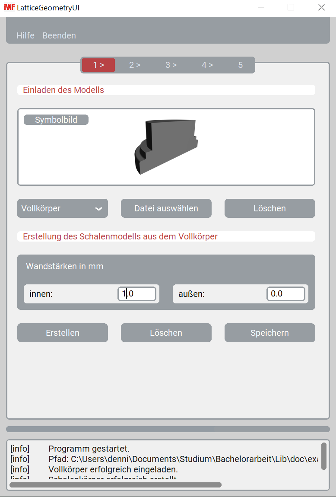

# LatticeGeometryUI

## Kurzbeschreibung

Die LatticeGeometryUI ist das User Interface zur ´´´latticegeometrylib´´´, welche Funktionen bereitstellt, um aus einer beliebigen Eingangsgeometrie eine Schalengeometrie mit Gitterkern zu erzeugen.
Die grafische Nutzeroberfläche hat hierbei die Aufgabe, diese Funktionen in einen einfach durchführbaren Workflow zu kombinieren.

## Vorraussetzungen 

## Verwendung

